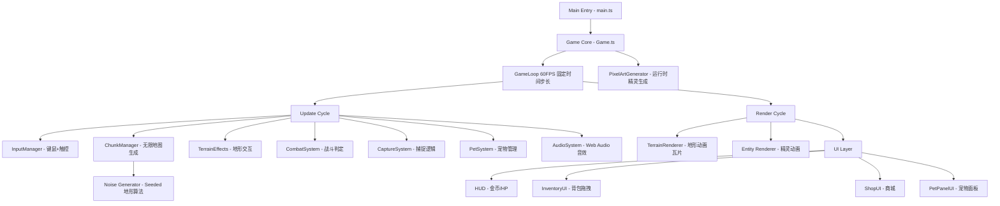

# 🎮 精灵收集手册 - Spirit Collection Handbook

> 一款商业级 8-bit 像素风格 2D 网页游戏 —— 在程序化生成的无限世界中探索六大地形、捕捉四类精灵、组建宠物战队，体验完整的冒险与收集玩法。

## 🏗️ 系统架构



## 🛠 技术栈

- **Frontend**: TypeScript + Vite + Canvas2D
- **Backend**: none
- **Database**: none
- **渲染引擎**: 纯 Canvas2D，零外部游戏引擎依赖
- **美术资源**: 运行时程序化生成所有像素精灵（零外部图片）
- **音效**: Web Audio API 程序化合成
- **地图生成**: 基于 Seeded Noise 的无限区块系统

## 🚀 启动指南

### ⚡ 快速启动（推荐）

1. 确保已安装 Node.js (v18+)
2. 在根目录执行：

```bash
npm install
npm run dev
```

3. 浏览器访问：http://localhost:3000

### 构建生产版本

```bash
npm run build
npm run preview
```

## 🔗 服务地址

- **Game**: http://localhost:3000

## 🎯 核心功能

### 1. 游戏基础系统
- 玩家初始属性：金币 100，生命值 300，UI 实时显示
- 猫咪角色，WASD 键控制移动（8方向），移动速度 3像素单位/秒（48px/s），平滑转向
- 轴分离碰撞检测，支持沿墙滑动，不会卡住
- 无限大地图，基于 512×512 像素区块无缝衔接，Noise 算法自然过渡

### 2. 六种地形系统
| 地形 | 视觉特征 | 交互效果 |
|------|----------|----------|
| 🌿 草原 | 草丛密度每100px²1-2丛，2帧晃动0.8s周期 | 无 |
| 🏔️ 高原 | 石头覆盖60%，草丛10%，轻微高度差 | 无 |
| 🏜️ 沙漠 | 沙子2帧流动1.2s周期，仙人掌障碍物 | 无 |
| 🌊 大海 | 水纹3帧动画0.6s周期 | 移动速度-30% |
| 🌋 火山 | 岩浆3帧流动0.5s周期 | 接触岩浆每秒20点伤害 |
| 🏰 地下城 | 30%障碍物，落石/地刺机关，宝箱 | 需探索全部5种地形后解锁 |

### 3. 物品系统
- 背包：30个槽位，Q键打开/关闭，显示图标、名称、数量
- 快捷栏：10个槽位（数字键1-0），底部常驻，选中高亮
- 支持背包与快捷栏之间拖拽交换，半透明预览

### 4. 商城系统 (M键)
| 精灵球 | 价格 | 基础捕捉概率 | 单次购买上限 |
|--------|------|-------------|-------------|
| 普通精灵球 | 5金币 | 40% | 无限 |
| 高级精灵球 | 15金币 | 60% | 10个 |
| 超级精灵球 | 30金币 | 99% | 5个 |

- 支持批量购买：+/- 按钮调整数量，一键购买多个
- 购买验证：金币充足性 → 扣除金币 → 物品入背包 → 面板内弹出成功/失败提示（2秒渐隐）
- 商城/背包打开时自动隐藏 HUD 和宠物面板，避免视觉重叠

### 5. 四种生物
| 生物 | 类型 | 移动速度 | 攻击范围 | 攻击间隔 |
|------|------|----------|----------|----------|
| 小骑士 | 持剑近战 | 中等 | 100px | 2s |
| 小弓箭手 | 远程攻击 | 较慢 | 300px | 3s |
| 烈焰兽 | 范围攻击 | 快速 | 150px | 2.5s |
| 果冻冻 | 弹性移动 | 1.5-4像素单位/s随机 | 80px | 1.5s |

- 随机生命值 (50-200) 和攻击力 (10-30)，生成时控制台输出属性
- 200像素警戒范围，主动追击并攻击玩家
- 完整 AI 状态机：idle → patrol → chase → attack → hurt → dead

### 6. 捕捉系统
- 选择精灵球后点击目标生物进行捕捉
- 概率公式：最终概率 = 基础概率 × (1 + HP加成)，HP<20%额外+50%，上限100%
- 3秒捕捉动画（投掷0.5s → 摇晃1.5s → 结果1s）
- 成功/失败均有视觉+音效反馈，成功获得20金币并显示浮动文字

### 7. 宠物系统
- 捕捉成功后自动加入宠物队伍（最多3只）
- 右下角宠物面板：64×64头像、绿色HP条实时更新、攻击力数值
- 点击面板派遣1只宠物出战，协助攻击野生生物，不攻击玩家
- 宠物晕倒后30秒冷却恢复

### 8. 音效系统
- 基于 Web Audio API 的程序化音效合成
- 覆盖：捕捉投掷/摇晃/成功/失败、战斗命中、玩家受伤、商店购买、宝箱开启、宠物部署/召回、岩浆/陷阱伤害

## 🎮 操作说明

| 按键 | 功能 |
|------|------|
| W/A/S/D | 移动（上/左/下/右，支持8方向） |
| Q | 打开/关闭背包 |
| M | 打开/关闭商城 |
| 1-0 | 选择快捷栏物品 |
| 鼠标左键 | 点击生物进行捕捉（需先选择精灵球） |
| 鼠标拖拽 | 背包/快捷栏物品交换 |
| 触屏左半区 | 虚拟摇杆移动（移动端） |
| 触屏右半区 | 点击交互（移动端） |

## 📁 项目结构

```
src/
├── main.ts                 # 入口文件，初始化与错误处理
├── Game.ts                 # 游戏主类，整合所有子系统的更新与渲染
├── engine/                 # 游戏引擎核心
│   ├── GameLoop.ts         # 60FPS固定时间步长游戏循环
│   ├── Camera.ts           # 摄像机（跟随玩家、坐标转换、视口裁剪）
│   ├── InputManager.ts     # 键盘鼠标+触控虚拟摇杆输入管理
│   └── ChunkManager.ts     # 无限地图区块管理、Noise地形生成、生物刷新
├── entities/               # 游戏实体
│   ├── Entity.ts           # 基础实体类（动画、伤害、碰撞）
│   ├── Player.ts           # 玩家角色（猫，WASD移动，宠物管理）
│   └── Creature.ts         # 生物类（完整AI状态机，宠物模式）
├── systems/                # 游戏逻辑系统
│   ├── Inventory.ts        # 背包与物品槽管理（堆叠、移除、查询）
│   ├── CombatSystem.ts     # 战斗判定与伤害浮动文字
│   ├── CaptureSystem.ts    # 捕捉概率计算与3秒动画状态机
│   ├── PetSystem.ts        # 宠物部署/召回/复活冷却
│   ├── ShopSystem.ts       # 商城购买逻辑（金币验证、限购）
│   └── AudioSystem.ts      # Web Audio API 程序化音效系统
├── terrain/                # 地形系统
│   ├── TerrainRenderer.ts  # 6种地形动画瓦片渲染
│   └── TerrainEffects.ts   # 地形效果（海洋减速、岩浆伤害、障碍碰撞）
├── ui/                     # 用户界面
│   ├── HUD.ts              # 顶部状态栏（金币+图标、HP条+猫头像、FPS）
│   ├── InventoryUI.ts      # 背包界面（30槽+10快捷栏，拖拽交换）
│   ├── ShopUI.ts           # 商城界面（3种精灵球，价格/概率/限购）
│   └── PetPanelUI.ts       # 右下角宠物面板（最多3只，点击出战）
├── assets/                 # 美术资源（全程序化生成，零外部图片）
│   ├── PixelArtGenerator.ts # 精灵生成器入口
│   ├── SpriteTypes.ts      # 精灵图集类型定义与工具函数
│   ├── PlayerSprites.ts    # 玩家猫咪精灵（8方向×4帧）
│   ├── TerrainSprites.ts   # 6种地形+装饰物精灵
│   ├── CreatureSprites.ts  # 4种生物精灵（各5组动画）
│   └── ItemSprites.ts      # 物品与UI精灵（精灵球、金币等）
└── utils/                  # 工具模块
    ├── constants.ts        # 全局游戏常量配置（一处修改全局生效）
    ├── math.ts             # 数学工具（Vector2、距离、碰撞检测）
    └── noise.ts            # Seeded Noise 噪声生成（地形算法）
```

## 🔧 专业工程实践

### 1. 日志系统
- 使用 `console.log` 带模块标签 `[Module]` 格式化输出（如 `[Capture]`、`[Combat]`、`[Shop]`）
- 生物生成、捕捉概率/结果、战斗伤害、商城购买等关键事件均有结构化日志
- 实时 FPS 计数器显示在屏幕右下角

### 2. 错误处理
- 游戏初始化失败时加载页面显示友好错误提示（红色文字 "加载失败，请刷新页面重试"）
- `try-catch` 包裹异步初始化流程，资源加载异常不会白屏崩溃
- 玩家死亡后2秒自动复活50%HP，显示"复活了！"浮动文字

### 3. 数据校验
- 购买前验证：金币充足性 → 限购数量 → 背包空间，每步失败均有明确提示
- 捕捉前验证：精灵球持有量、目标存活状态、是否正在捕捉中
- 物品堆叠上限校验，背包满时购买自动退款

### 4. 接口设计
- 模块化架构，30+ 源文件分布在 8 个目录，职责清晰
- 事件驱动的输入系统（键盘/鼠标/触控统一接口）
- 统一的精灵图集接口 `SpriteAtlas`，所有渲染模块共享
- 游戏常量集中在 `constants.ts`，一处修改全局生效

### 5. 生产级特性清单

| 维度 | 状态 | 说明 |
|------|------|------|
| 响应式布局 | ✅ | 支持桌面(1920×1080)、平板(1024×768)、手机(720×1280) |
| 触控支持 | ✅ | 虚拟摇杆移动 + 右侧点击交互 |
| 模块化架构 | ✅ | 30+ 独立模块，清晰的职责划分 |
| 性能优化 | ✅ | 视口裁剪、区块动态加载/卸载、固定时间步长 |
| 动画系统 | ✅ | 多帧精灵动画，所有动画均 24FPS |
| AI系统 | ✅ | 6状态有限状态机驱动 |
| 音效系统 | ✅ | 14种音效，Web Audio API 程序化合成 |
| 程序化生成 | ✅ | 地图+全部美术资源运行时生成 |
| 碰撞检测 | ✅ | 轴分离碰撞，支持沿墙滑动 |
| 零外部依赖 | ✅ | 仅 TypeScript + Vite 开发依赖 |

## 🛠️ 开发实现路径

1. **引擎搭建** → 60FPS游戏循环 + Canvas渲染 + 摄像机系统
2. **无限地图** → Noise地形生成 + 区块管理 + 6种地形渲染
3. **玩家系统** → 猫咪角色 + WASD移动 + 8方向动画
4. **生物AI** → 4种生物 + 状态机 + 警戒/追击/攻击
5. **物品商城** → 背包/快捷栏 + 拖拽 + 商城购买
6. **捕捉宠物** → 概率计算 + 3秒动画 + 宠物出战
7. **音效UI** → Web Audio音效 + HUD + 宠物面板 + 响应式适配
